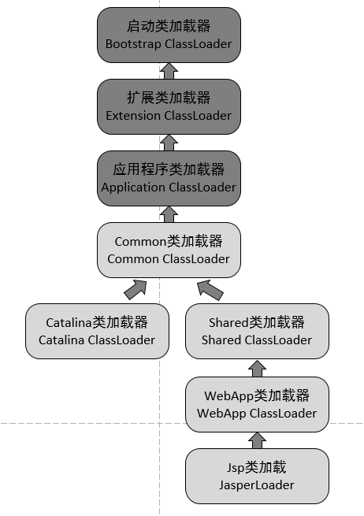

# 类加载机制

类从被加载到虚拟机内存中开始，到卸载出内存为止，它的整个生命周期包括：加载、验证、准备、解析、初始化、使用和卸载七个阶段。加载、验证、准备、初始化顺序确定。

**双亲委派模式**是在Java 1.2后引入的，其工作原理的是，如果一个类加载器收到了类加载请求，它并不会自己先去加载，而是把这个请求委托给父类的加载器去执行，如果父类加载器还存在其父类加载器，则进一步向上委托，依次递归，请求最终将到达顶层的启动类加载器，如果父类加载器可以完成类加载任务，就成功返回，倘若父类加载器无法完成此加载任务，子加载器才会尝试自己去加载，这就是双亲委派模式，即每个儿子都很懒，每次有活就丢给父亲去干，直到父亲说这件事我也干不了时，儿子自己想办法去完成。**好处是Java类随着它的类加载器一起具备了一种带有优先级的层次关系，通过这种层级关系可以避免类的重复加载，防止用户自定义同名类引起冲突。**

**加载：**

1. 根据类名从Class文件、Jar包、网络中获取二进制字节流(字节码文件)。
2. 将字节流代表的静态存储结构转换为<span style="color: red;"> ***方法区*** </span>的运行时数据结构。 
3. 在Java 堆区生成一个类对象，作为对方法区数据的访问入口。

启动类加载器：Bootstrap ClassLoader。

扩展类加载器：Extension ClassLoader。

应用程序加载器：Application ClassLoader。默认加载器。

**验证：**确保Class文件的字节流符合虚拟机要求，并且不会危害虚拟机安全。

<span style="color: red;">文件格式的验证、元数据的验证（语义分析）、字节码验证（方法体校验）和符号引用验证（常量池中符号引用）。</span>

**准备：**为类变量在方法区中分配内存，初始化默认值。 除ConstantValue （final static 修饰的常量）。

**解析：**将常量池中的符号引用转换为直接引用。

> 符号引用：带有类型（tag） / 结构（符号间引用层次）的字符串。
>
> ```Java
>   #2 = Methodref          #3.#17         //  X.bar:()V
>   #3 = Class              #18            //  X
>   #18 = Utf8               X
>   #17 = NameAndType        #13:#6         //  bar:()V
>   #13 = Utf8               bar
>   #6 = Utf8               ()V
> ```
>
> 直接引用：JVM能直接使用的数据，指针，偏移量。

**初始化：**初始化阶段是执行类构造器```<clinit>()```方法的过程。


**主动引用：**

- 遇到new、getstatic、putstatic、invokestatic这四条字节码指令时，如果类还没有进行过初始化，则需要先触发其初始化。生成这四条指令最常见的Java代码场景是：使用new关键字实例化对象时、读取或设置一个类的静态字段（static）时（被static修饰又被final修饰的，已在编译期把结果放入常量池的静态字段除外）、以及调用一个类的静态方法时。
- 使用Java.lang.refect包的方法对类进行反射调用时，如果类还没有进行过初始化，则需要先触发其初始化。
- 当初始化一个类的时候，如果发现其父类还没有进行初始化，则需要先触发其父类的初始化。
- 当虚拟机启动时，用户需要指定一个要执行的主类，虚拟机会先执行该主类。

**被动引用：**

- 通过子类引用父类的静态字段，不会初始化子类。
- 常量会在编译期间放在该类的常量池里，没有直接引用到定义类。
- 数组定义类


当运行一个程序时，JVM启动，运行bootstrap classloader ，该classloader加载核心API（Ext classloader 和app classloader 也在此时被加载），then 调用ext classloader 加载扩展API，最后app classloader 加载classpath目录下定义的class，这就是一个程序最基本的加载流程。

通过classloader加载类实际上就是加载的时候并不对该类进行解析，因此也不会初始化，而class类的forName方法则相反，使用forName方法加载的时候会将class进行解析与初始化。


### Tomcat 违背双亲委派模式



我们思考一下：Tomcat是个web容器， 那么它要解决什么问题：

1. 一个web容器可能需要部署两个应用程序，不同的应用程序可能会依赖**同一个第三方类库的不同版本**，不能要求同一个类库在同一个服务器只有一份，因此要保证每个应用程序的类库都是独立的，保证相互隔离。
2. 部署在同一个web容器中相同的类库相同的版本可以共享。否则，如果服务器有10个应用程序，那么要有10份相同的类库加载进虚拟机，这是扯淡的。
3. web容器也有自己依赖的类库，不能于应用程序的类库混淆。基于安全考虑，应该让容器的类库和程序的类库隔离开来。
4. web容器要支持jsp的修改，我们知道，jsp 文件最终也是要编译成class文件才能在虚拟机中运行，但程序运行后修改jsp已经是司空见惯的事情，否则要你何用？ 所以，web容器需要支持 jsp 修改后不用重启。


WebApp类加载器和Jsp类加载器通常会存在多个实例，**每一个Web应用程序**对应一个WebApp类加载器，每一个JSP文件对应一个Jsp类加载器。

**CommonLoader**：Tomcat最基本的类加载器，加载路径中的class可以被Tomcat容器本身以及各个Webapp访问；

**CatalinaLoader**：Tomcat容器私有的类加载器，加载路径中的class对于Webapp不可见；

**SharedLoader**：各个Webapp共享的类加载器，加载路径中的class对于所有Webapp可见，但是对于Tomcat容器不可见；

**WebappClassLoader**：各个Webapp私有的类加载器，加载路径中的class只对当前Webapp可见；

Tomcat 为了实现隔离性，没有遵守这个约定，每个webappClassLoader加载自己的目录下的class文件，不会传递给父类加载器。