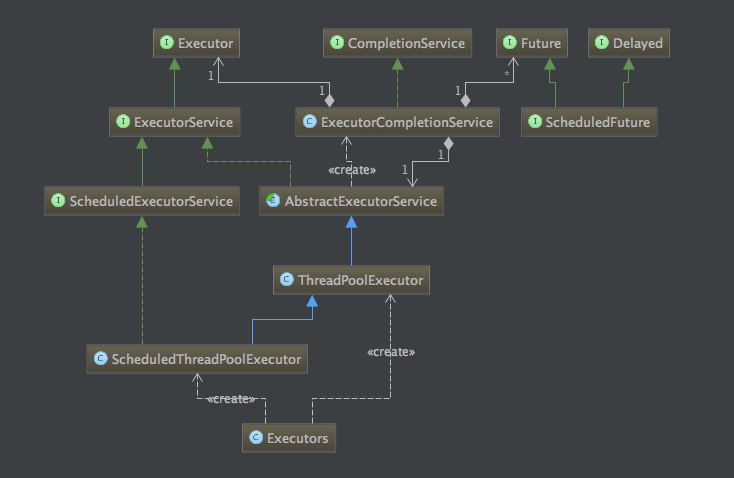
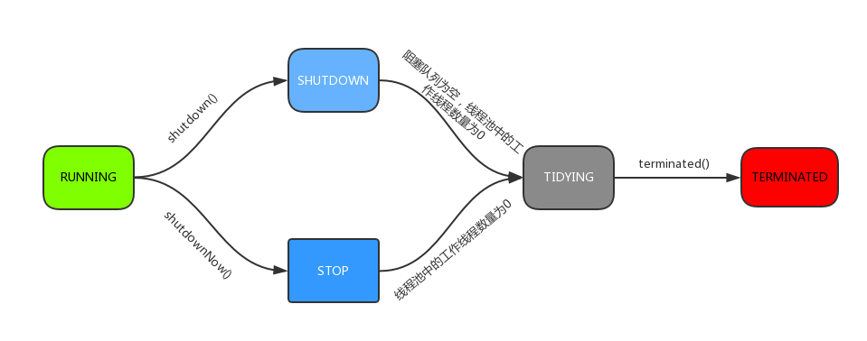

# 线程池

优点：

- 降低资源消耗。通过重复利用已创建的线程降低线程创建和销毁造成的消耗。
- 提高响应速度。当任务到达时，任务可以不需要的等到线程创建就能立即执行。
- 提高线程的可管理性。线程是稀缺资源，如果无限制的创建，不仅会消耗系统资源，还会降低系统的稳定性，使用线程池可以进行统一的分配，调优和监控。

文件接口：



## Executor框架接口

Executor框架是一个根据一组执行策略调用，调度，执行和控制的异步任务的框架，目的是提供一种将”任务提交”与”任务如何运行”分离开来的机制。

### ExecutorService接口

ExecutorService接口继承自Executor接口，提供了管理终止的方法，以及可为跟踪一个或多个异步任务执行状况而生成 Future 的方法。增加了shutDown()，shutDownNow()，invokeAll()，invokeAny()和submit()等方法。如果需要支持即时关闭，也就是shutDownNow()方法，则任务需要正确处理中断。

### ScheduledExecutorService接口

ScheduledExecutorService扩展ExecutorService接口并增加了schedule方法。调用schedule方法可以在指定的延时后执行一个Runnable或者Callable任务。ScheduledExecutorService接口还定义了按照指定时间间隔定期执行任务的scheduleAtFixedRate()方法和scheduleWithFixedDelay()方法。


状态转移：



```
private static int runStateOf(int c)     { return c & ~CAPACITY; }
private static int workerCountOf(int c)  { return c & CAPACITY; }
private static int ctlOf(int rs, int wc) { return rs | wc; }
```

- **runStateOf**：获取运行状态；
- **workerCountOf**：获取活动线程数；
- **ctlOf**：获取运行状态和活动线程数的值。