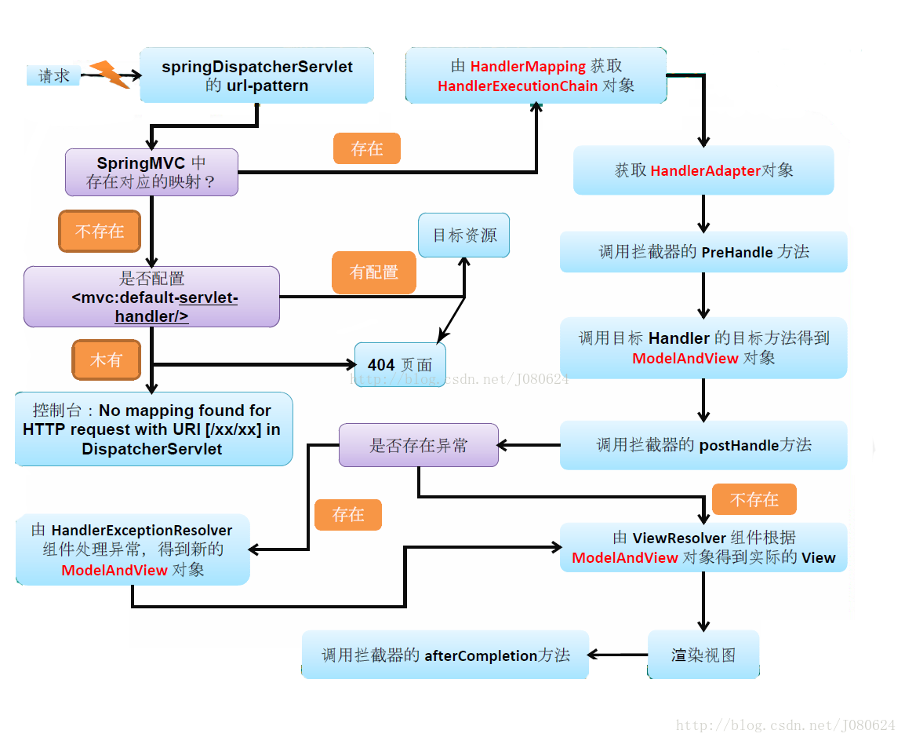

# SpringMVC

# Spring IOC

IOC初始化：

1. Resource定位 
   找到配置文件，类路径：ClassPathResource；文件系统：FileSystemResource 
2. BeanDefinition载入 
   把用户定义好Bean表示成IOC内部数据结构，BeanDefinition 
3. 向IOC容器中注册BeanDefinition

4. 通过BeanDefinitionRegistory将BeanDefinition注入到一个HashMap中，IOC容器通过HashMap持有这些Bean