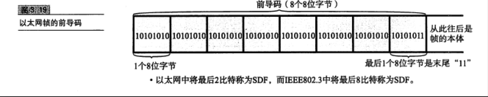
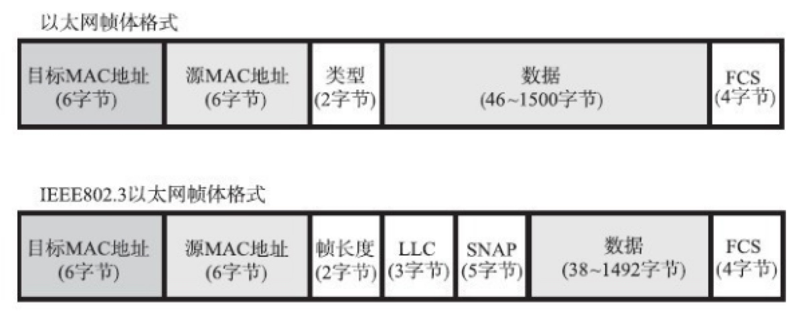

# TCP/IP
OSI：物理层，数据链路层，网络层，传输层，会话层，表示层，应用层。


###数据链路层：
该协议定义了通过通信媒介互联的设备之间传输的规范。

**共享介质型网络**：设备之间使用同一个载波信道(同轴电缆)。
争用方式(载波监听多路访问),令牌传递方式.
**非共享介质型网络**:直连交换机。交换机转发方式：存储转发，直通转发。

**环路监测**：

* 生成树：以某一网桥构造树根，对各端口设置权重，禁止某些端口的使用。
* 源路由：判断源地址是通过哪个网桥传输的，将帧写入RIF，网桥根据这个RIF发送帧给目标地址。

**以太网**：局域网的一种传输协议。它规定了包括物理层的连线、电子信号和介质访问层协议的内容。

* 以太网帧：8个8位的前导码。

* 帧本体的前端是以太网首部。分别是6字节的目标Mac地址，6字节的源Mac地址，2字节以上的上层协议类型。


# HTTP

**在HTTP/1.0中，默认使用的是短连接**。也就是说，浏览器和服务器每进行一次HTTP操作，就建立一次连接，但任务结束就中断连接。如果客户端浏览器访问的某个HTML或其他类型的 Web页中包含有其他的Web资源，如JavaScript文件、图像文件、CSS文件等；当浏览器每遇到这样一个Web资源，就会建立一个HTTP会话。

但从 **HTTP/1.1起，默认使用长连接**，用以保持连接特性。使用长连接的HTTP协议，会在响应头有加入这行代码：

```
`Connection:keep-alive`
```

