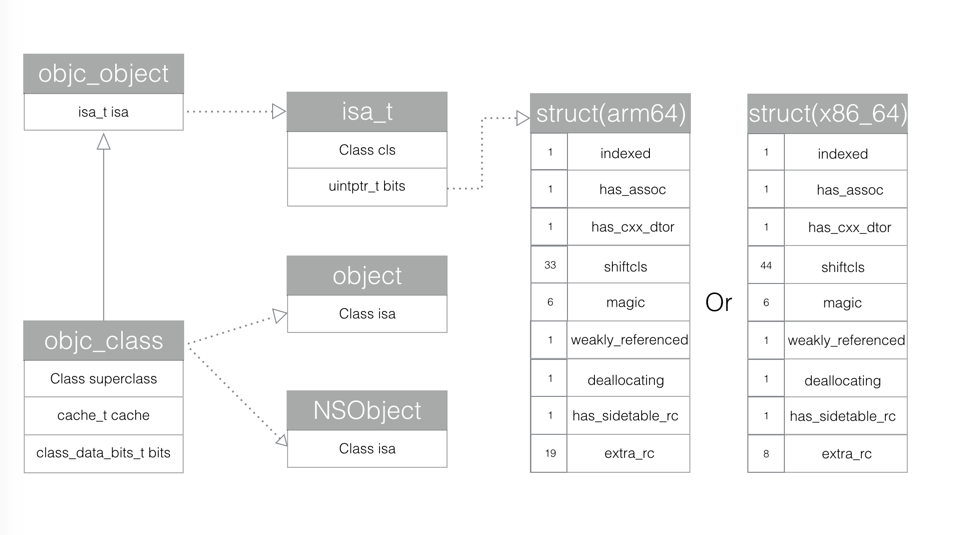
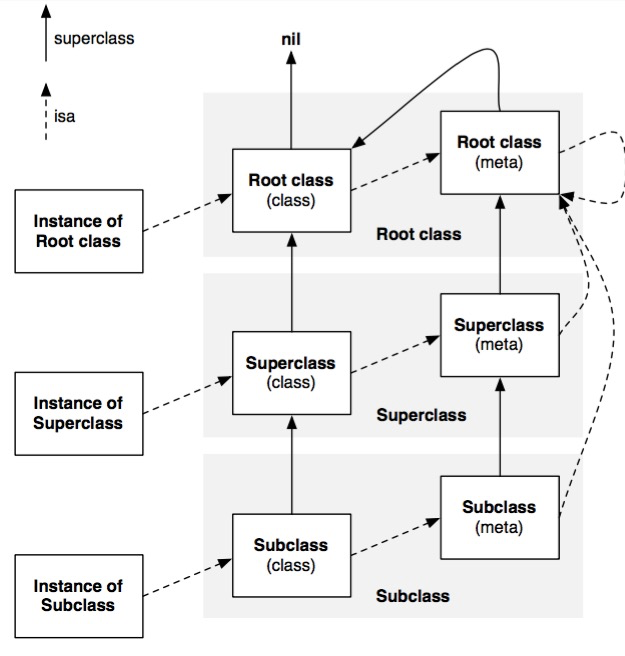

# 神经病院 入院Runtime

然后在2006年苹果发布Objc 2.0之后，objc_class的定义就变成下面这个样子了。

```
typedef struct objc_class *Class;
typedef struct objc_object *id;

@interface Object { 
    Class isa; 
}

@interface NSObject <NSObject> {
    Class isa  OBJC_ISA_AVAILABILITY;
}

struct objc_object {
private:
    isa_t isa;
}

struct objc_class : objc_object {
    // Class ISA;
    Class superclass;
    cache_t cache;             // formerly cache pointer and vtable
    class_data_bits_t bits;    // class_rw_t * plus custom rr/alloc flags
}

union isa_t 
{
    isa_t() { }
    isa_t(uintptr_t value) : bits(value) { }
    Class cls;
    uintptr_t bits;
}
```

把源码的定义转化成类图，就是上图的样子：


在objc_class中，除了isa之外，还有3个成员变量，一个是父类的指针，一个是方法缓存，最后一个这个类的实例方法链表。

关于对象，类，元类的关系：


####（1）isa_t 结构体的具体实现

```
struct objc_object {
private:
    isa_t isa;
public:
    // initIsa() should be used to init the isa of new objects only.
    // If this object already has an isa, use changeIsa() for correctness.
    // initInstanceIsa(): objects with no custom RR/AWZ
    void initIsa(Class cls /*indexed=false*/);
    void initInstanceIsa(Class cls, bool hasCxxDtor);
private:
    void initIsa(Class newCls, bool indexed, bool hasCxxDtor);
｝
```


